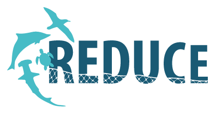

# Workshop: AI-Driven Image Recognition Techniques

Welcome to the repository for the **AI-Driven Image Recognition Techniques** workshop of the REDUCE project: Reducing Bycatch of Threatened Megafauna in the East Central Atlantic.

This three-day hands-on workshop, held from May 5 to 7, 2025, at the University of Barcelona (Spain), was designed to cover AI-driven image recognition techniques that can be used for marine species identification.

---

## 📌 Workshop Objectives

- Introduce core AI-driven image recognition techniques, from classic to state-of-the-art deep learning methods.  
- Provide hands-on experience in implementing and fine-tuning deep-learning models for species identification.  
- Discuss recent breakthroughs in Convolutional Neural Networks (CNNs) and Transformer-based vision architectures.  
- Explore real-world applications in fisheries monitoring and bycatch mitigation.

---

## 🗓️ Schedule & Content

### **Day 2 - May 6, 2025**  
**Theme:** *Deep Learning Techniques for Image Recognition*  
**Instructors:** <br>• [Catarina Silva](https://catarinasilva.weebly.com), University of Coimbra (CFE), Portugal <br>• [Ricardo Cardoso Pereira](https://ricardodcpereira.com/), University of Coimbra (CISUC), Portugal

| Session | Duration | Topics |
|---------|----------|--------|
| **Theoretical** | 1 h | • Why deep learning excels in vision tasks <br>• Neural-network components (layers, activations, etc.) <br>• CNN building blocks: convolutions, pooling, fully-connected layers <br>• Landmark architectures (e.g., ResNet) <br>• Transfer learning & pre-trained models <br>• Vision Transformers (ViTs) |
| **Practical (Colab)** | 2 h | Guided notebook: training & fine-tuning a CNN / ViT for species identification |

---

### **Day 2 - May 7, 2025**  
**Theme:** *Evaluating Model Performance*  
**Instructors:** <br>• [Nina del Rio Ares](https://www.iim.csic.es/en/about-iim/staff/nina-del-rio), Institute of Marine Research (IIM-CSIC), Spain <br>• [Catarina Silva](https://catarinasilva.weebly.com), University of Coimbra (CFE), Portugal <br>• [Ricardo Cardoso Pereira](https://ricardodcpereira.com/), University of Coimbra (CISUC), Portugal  

| Session | Duration | Topics |
|---------|----------|--------|
| **Theoretical** | 1 h | • Performance metrics (accuracy, precision, confusion matrix, etc.) <br>• Avoiding overfitting (dropout & data augmentation) <br>• Cross-validation strategies (k-fold) |
| **Practical (Colab)** | 2 h | Guided notebook: model evaluation & error analysis |

---

## ⚙️ Technical Details

You can run the practical component of the workshop both locally and on Google Colab.

### 1. Run Locally (Python 3.11)

In an environment running Python 3.11 and capable of opening Jupyter Notebooks, install the project dependencies using:
```bash
pip install -r requirements.txt
```

Afterward, open the provided `.ipynb` file and run all cells.

> **Tip:** A GPU-enabled environment (CUDA-capable) will speed up training, but is optional.

### 2. Google Colab (Zero-Install)

1. Open [Google Colab](https://colab.research.google.com).
2. Press **File → Upload notebook** and select the provided `.ipynb` file.
3. Upload the `images` folder and the `model_params.pt` file to the Colab "Files" pane.
4. Press **Runtime → Run all**.

**Colab already includes the required libraries, so no extra installation is needed.**

> **Tip:** Selecting the T4 GPU-enabled runtime will speed up training, but is optional.

---

## 🙏 Acknowledgments

The images used in this workshop were obtained from [GBIF - Global Biodiversity Information Facility](https://www.gbif.org/).

GBIF is an international network and data infrastructure funded by the world's governments and aimed at providing anyone, anywhere, open access to data about all types of life on Earth.

---

## 📄 License

Distributed under the GNU General Public License v3. See `LICENSE` for more information.